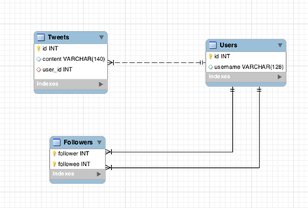

BookshelfJS Example
========================

It doesn't look like anyone has done a full or semi-fledged example of how to use [BookshelfJS](http://bookshelfjs.org/) in something like [Express](http://expressjs.com/).

Most examples have all the models in the same file. This obviously won't work well if you're dealing with a larger app. So here is an attempt at using BookshelfJS in such a manner.

### Database Schema

In this example, I used a MySQL database with the following schema:

It's your classic [Twitter clone](http://ruby.railstutorial.org/ruby-on-rails-tutorial-book), stripped down quite a bit.

We're not going to do a UI or validation. In fact, this example will only implement about half a REST API.

As you can see, we will have fairly standard **one-to-many** relationship and then a more complex **many-to-many** relationship via a join/bridge table.

An additional twist is the fact that both sides of the relationship are User models.

**For clarity:** In the Followers table, `follower` is the user ID of the user initiating the action while `followee` is the user ID of the person being acted upon. So when Alice follows Bob, Alice's ID is the `follower` and Bob's ID is the `followee`.

Okay - go look in the `src/app.js` folder and read the comments.